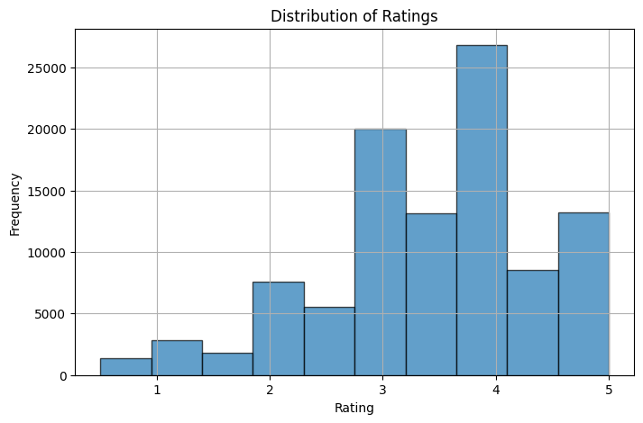
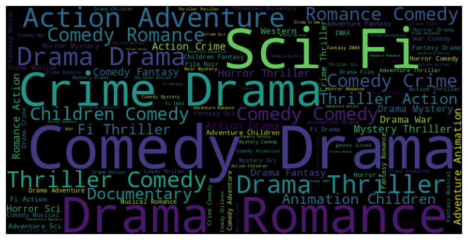

# *PHASE 4 PROJECT - RECOMMENDATION SYSTEMS*

## *Introduction*
The movie industry continues to grow rapidly and with endless options available, user engagement is vital. This entails personalizing user’ movie-watching experience with intuitive recommendations that can provide them with fascinating options depending on what they like, while also attracting them with additional content that they may enjoy.
It is for this reason that we are developing a recommendation system for a streaming company, to not only attract users but also keep them coming back. To accomplish this, our recommender system will generate five (5) recommendations for a user.

## *Problem Statement*
The movie streaming platforms currently suffers from low user engagement due to the difficulty of finding movies that match individual interests. Our goal is to develop a personalized movie recommendation system that suggests movies to users based on their ratings of other films. This will enhance user satisfaction and retention on the platform.

Stakeholder : Movie streaming platform like Netflix and Hulu.

 These companies face the real-world problem of low user engagement on their platforms caused by difficulty finding movies that match individual interests. This results in reduced customer retention and satisfaction, a major challenge streaming platforms contend with in the industry. The MovieLens dataset leveraged contains real user ratings data appropriate for addressing this problem.

 A model trained on MovieLens data can provide personalized recommendations that tailor suggestions to each user's tastes and preferences. This improves the ability for users to find relevant movies on streaming platforms, which could increase customer engagement, satisfaction, and retention. The project and model results could provide value to real streaming company stakeholders, as this problem exists in reality rather than hypothetically. Platform executives of the movie-streaming service could implement this type of solution to better engage users by connecting them with movie content that caters to their preferences.

 ## *Data Understanding*
 The core dataset used, MovieLens, contains real movie ratings provided by users of the MovieLens service, which shares characteristics with popular streaming platforms.
The ratings data reveals user preferences and patterns that can be leveraged to make accurate, personalized recommendations. The additional movie metadata, like titles and genres, further enhances the model's ability to suggest appropriate content.
By training a collaborative filtering model on this ratings dataset, the system can learn to predict how much an individual user would enjoy movies they have yet to see, based on ratings from similar users. The model validation process, using RMSE, provides confidence that the system generalizes accurately to new users.

The data comprised of 4 datasets. Movies, Links, Tags and Ratings. 

The following are the column descriptions of the various columns in the 4 datasets.

#### 1. Movies
movieId: the unique numerical identifier for each movie. This ID is used to connect the movie information with the ratings and links datasets.

title: The name of the movie together with its year of release, is a string type.

genres: Genres associated with the movie.

#### 2. Links
movieId: A unique identifier for each movie. This identifier corresponds to the movie ID in the MovieLens dataset.

imdbId: The identifier of the movie in the IMDb (Internet Movie Database) system. This identifier is used to connect the movie with its corresponding entry in the IMDb database.

tmdbId: The identifier of the movie in the TMDB (The Movie Database) system. This identifier links the movie to its corresponding entry in the TMDB database.

#### 3. Tags
userId: The user's unique Identifier

movieId: The Movie's Unique identifier

tag: the tag entered by a user to describe a movie

timestamp: Timestamps represent seconds since midnight Coordinated Universal Time (UTC) of January 1, 1970.

#### 4. Ratings
userId: unique integer identifier for each user, to track their interactions

movieId: A unique integer identifier for each movie. This identifier connects the ratings with specific movies. It links user ratings to the movies they've interacted with.

rating: The value representing how much a user liked a particular movie. ranging from 0.5 to 5, with half-star increments.

timestamp: A timestamp indicating when the rating was given. Timestamps represent seconds since midnight Coordinated Universal Time (UTC) of January 1, 1970.

## *Data Pre processing*
The csv files were loaded from my local machine and read into a pandas dataframe. This was done after the necessary libraries were imported.
The data was then explored using functions and methods such as .describe(), .shape(), .info() and .duplicated()

## *Data Cleaning*
After exploring the data, the data was cleaned. There were no duplicates values in all the datasets. However there were missing values in the links dataset. The missing values, however only 8 out of 9742. 
    
We dropped the missing values since they were a very small percentage. Futhermore, we dropped the timestamp column because we would not need it for later.

## *Data Visualisations*
We did a few visualisations to see some insights such as the most popular genres by count. Below is a histogram showing the distribution of ratings.

We also had a wordcloud to show the top genres.

## *Modeling*
 There are two types of recommendation systems that we will use for this task are ;

1. Content-Based

2. Collaborative Filtering

For this task we will mainly focus on Collaborative Filtering
We started with content based then did collaborative filtering next so as to come up with the recommendations of the user. 
Using content based, which would compare movies with respect to genres, we got the the following output.
1. Amazing Panda Adventure, The (1995) (Adventure|Children)
2. Casper (1995) (Adventure|Children)
3. Far From Home: The Adventures of Yellow Dog (1995) (Adventure|Children)
4. Lassie (1994) (Adventure|Children)
5. Homeward Bound II: Lost in San Francisco (1996) (Adventure|Children)   

Then, we proceeded to collaborative filtering where we predicted the ratings of movies that users had not rated.
We then recommeded other movies based on their past ratings. We got this output;

	movieId	title	genres	predicted_rating
277	318	Shawshank Redemption, The (1994)	Crime|Drama	4.177309
2226	2959	Fight Club (1999)	Action|Crime|Drama|Thriller	4.107458
686	904	Rear Window (1954)	Mystery|Thriller	4.099534
602	750	Dr. Strangelove or: How I Learned to Stop Worr...	Comedy|War	4.093082
906	1204	Lawrence of Arabia (1962)	Adventure|Drama|War	4.082523

## *Summary*
This movie recommendation system combined content-based and collaborative filtering techniques to suggest personalized movies. The surprise library enabled efficient loading, splitting, and preprocessing of the ratings data. A user-user collaborative filtering approach identified similar users based on rating patterns. This allowed generating recommendations aligned to preferences of like-minded users. Evaluation using RMSE confirmed recommendation accuracy, with the optimal SVD model achieving 0.8913 on the test set. Grid search helped tune this matrix factorization algorithm to minimize error. For each user, predicting ratings for unseen movies produced a top 5 list of recommended titles matching their interests. Overall, custom recommendations based on user ratings and movie genres achieved the goal of enhancing satisfaction by helping users discover new movies suited to their tastes. This system could effectively increase engagement on movie streaming platforms.

## *Recommendations*
1. Incorporate additional data sources to enrich movie and user profiles. The
current system only uses movie genre and user rating data. Adding metadata like movie plots, cast, directors, user demographics, social connections, etc could improve recommendations. APIs from sources like IMDb and TMDB can provide additional movie attributes.
2. Implement a hybrid recommendation system blending collaborative filtering with content-based similarity. The current system relies solely on collaborative filtering based on user ratings. Adding content-based filters using data like movie genres, plots, and cast could improve suggestions for users with limited rating history. A hybrid approach combining the two could enhance accuracy.
3. Optimize for recommendation diversity to avoid filter bubbles. The current system focuses solely on prediction accuracy. Adding diversity controls could ensure users get exposed to a wider range of movie genres and types outside their comfort zone. This provides a richer experience.
4. Develop a productionized environment for large-scale usage. The current notebook is suitable for demonstrating the approach. To deploy the system for real-world usage would require translating to scalable production infrastructure. This includes distributed model training, low-latency recommendation serving, and refresh processes to update the model as new data arrives.

## *Next Steps*
- Migrate the prototype to scalable cloud-based production infrastructure to handle large volumes of data and traffic
- Implement distributed model training techniques for faster and more efficient learning from growing data
- Set up low-latency recommendation servers to provide real-time suggestion serving with minimal delays
- Incorporate continuous integration and delivery pipelines to refresh the model as new user ratings arrive
- Monitor and optimize system performance, availability and reliability to ensure a smooth customer experience
- Conduct A/B testing to guide future product development and improvement of the recommendation engine

